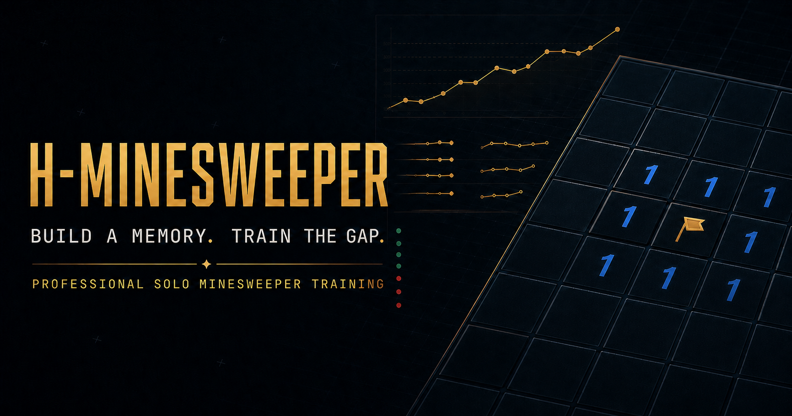

# H-MineSweeper

<p align="center">
  
</p>

<p align="center">
  <strong>同一张棋盘，同一个时钟。</strong><br />
  <strong>Same board. Same clock.</strong>
</p>

<p align="center">
  <a href="#中文">中文</a> · <a href="#english">English</a>
</p>

---

## 中文

H-MineSweeper 是一个黑金风格的低延迟扫雷项目。目前版本同时提供完整的本地单人游戏、循序渐进的扫雷学院，以及使用同一张棋盘进行实时竞速的 1v1 房间。

这个仓库仍处于 Phase 0.5。单人和教学部分可以完整游玩；多人模式用于验证操作手感、实时进度和 Bo3 对抗循环，还不是正式排位系统。

### 当前可以体验什么

| 模式 | 当前能力 | 成绩状态 |
| --- | --- | --- |
| 单人游戏 | 初级、中级、高级、自定义、经典随机、无猜生成 | 本地保存，不进入公开榜 |
| 扫雷学院 | 第 0 至 3 章、分级提示、proof 验证、定式与反例 | 训练成绩 |
| 多人对战 | 房间码 1v1、同图竞速、Bo3、进度对比、即时重赛 | 原型比赛，无正式评级 |

### 单人游戏

- 标准难度为 9×9 / 10 雷、16×16 / 40 雷、30×16 / 99 雷。
- 自定义宽高支持 5 至 100，总格数不超过 10,000。
- 首次揭格保留 3×3 安全区。
- 无猜生成在 Worker 中运行，最多尝试 50 次或 5 秒。生成时间不计入游戏时间。
- 统计面板支持时间、操作数、CPS、3BV、3BV/s、IOE、无效动作和旗标明细。
- 三套棋盘显示方案覆盖舒适、专业和高对比场景。
- 数字、旗帜、雷标和错旗均由 Canvas 矢量绘制，在高级棋盘的小格尺寸下仍保持清楚。

### 扫雷学院

学院不要求玩家背脱离棋形的口诀。每道题都从当前可见状态推导答案。

- 第 0 章：揭格、插旗、和弦和数字含义。
- 第 1 章：剩余雷数、已标雷与矛盾。
- 第 2 章：共有区、独享区和集合包含。
- 第 3 章：1-2-1、1-2-2-1 及其反例。
- H1 至 H7 提示会逐级展开。高级提示来自求解器 proof，不读取隐藏雷图猜答案。
- 学习进度、Logic Streak 和练习记录保存在本机。

### 1v1 对战

两名玩家在各自界面解决同一张 Expert 无猜棋盘。双方不会抢格，也看不到对方的点击路线。

- 3 秒同步倒计时。
- 三局两胜，平局不计胜局，最多使用五张棋盘。
- 单局上限 180 秒，终局使用 50ms 裁定窗口。
- 对手进度以 10Hz 合并更新。
- 每个测试房间最多使用 15 张不重复棋盘。
- 赛后可以下载 JSON 回放并直接发起重赛。

当前 1v1 使用 `client_seed`。客户端即时展开棋盘，服务端独立复算动作和结果。这套模式适合测试手感，但无法提供正式排行榜所需的反作弊强度。断线或状态分歧会冻结当前比赛并记为技术 DNF。

### 操作

| 设备 | 揭格 | 插旗 | 和弦 |
| --- | --- | --- | --- |
| 鼠标 | 左键 | 右键 | 中键或左右键组合 |
| 键盘 | Enter / Space | F | C |
| 触屏 | 点击 | 长按 350ms | 点击已揭数字 |

触屏棋盘支持平移和双指缩放。键盘方向键可以移动焦点。

### 本地运行

需要：

- Node.js 22.12 或更高版本
- pnpm 11

安装依赖并启动 Web 与实时服务：

```bash
pnpm install
pnpm dev
```

浏览器打开：

```text
http://127.0.0.1:5173
```

默认实时服务地址为 `http://127.0.0.1:3001`。Vite 会代理 HTTP 和 WebSocket 请求。

如果默认端口已被占用，可以同时修改服务端端口和开发代理：

```bash
H_MINESWEEPER_PORT=3101 \
VITE_DEV_SERVER_URL=http://127.0.0.1:3101 \
pnpm dev
```

其他配置见 [`.env.example`](./.env.example)。

### 常用命令

| 命令 | 用途 |
| --- | --- |
| `pnpm dev` | 并行启动 Web 与实时服务 |
| `pnpm typecheck` | 检查全部 workspace 的 TypeScript |
| `pnpm test` | 运行单元与集成测试 |
| `pnpm build` | 构建三个 workspace |
| `pnpm check` | 依次运行类型检查、测试和生产构建 |

### 工程结构

```text
apps/web             React 19、Vite 8、Canvas 2D、单人游戏与扫雷学院
apps/server          Fastify 5、ws 8、REST、实时网关与房间 Actor
packages/game-core   PRNG、棋盘规则、求解器、协议、统计与 golden vectors
scripts              可复现的品牌棋盘资产生成脚本
```

React 负责菜单、配置面板和结果页。实际扫雷棋盘使用双层 Canvas 2D，基础棋盘与短时特效分开绘制。棋盘状态使用 typed array；普通动作只重绘发生变化的格子。

服务端为每个房间维护单写者 Actor。动作按接收顺序执行，热路径不访问数据库。客户端动作带有幂等 ID、序号和状态哈希；缺失事件可以补发，事件环不足时使用快照恢复。

### 测试与性能

```bash
pnpm check
```

测试覆盖：

- 固定 seed、首击安全、邻雷计数、洪泛、插旗与和弦。
- 无猜求解 proof、3BV、CPS、3BV/s 和 IOE。
- 双客户端 WebSocket、Bo3 重赛、重复动作、终局竞态和房间回收。
- 棋盘脏格重绘、像素预算和最小格可读性。

浏览器性能样本保存在 `globalThis.__HMS_PERF__`。其中包括输入到下一帧、规则应用、整盘绘制、脏格绘制和特效层帧间隔。这些数据用于本地回归检查，不代表公开 Beta 的跨设备 SLA。

### 当前边界

以下能力尚未实现：

- 2 至 10 人房间与重连。
- OIDC 账号、匹配、Glicko-2 评级和赛季。
- `server_secret` 正式棋盘与一次性棋盘库存。
- 数据库、持久化回放和公开排行榜。
- 举报、隔离复核与申诉流程。

正式排位不会直接沿用当前 `client_seed` 模式。它需要服务器保密雷图、完整权威回放和经过验证的延迟公平性。

### 后续计划

1. 使用熟练玩家验证 1v1 的直接对抗感、重赛率和延迟体验。
2. 加入 2 至 10 人休闲房、快照重连和完整遥测。
3. 建设 `server_secret`、影子评级、匹配与持久化回放。
4. 达到公平性和反作弊闸门后，再开放正式排位与公开榜。

### 许可证

这个仓库目前公开用于查看、测试和协作，但尚未选择开源许可证。除非后续添加许可证，否则代码复用仍受默认版权规则约束。

---

## English

H-MineSweeper is a low-latency Minesweeper project with a black-and-gold interface. The current build includes a complete local solo game, a guided training mode, and real-time 1v1 rooms where both players race on the same board.

The repository is at Phase 0.5. Solo play and the training chapters are fully playable. Multiplayer is an early test of input feel, live progress, and the best-of-three match loop. It is not a ranked service yet.

### What you can play

| Mode | Available now | Result status |
| --- | --- | --- |
| Solo | Beginner, Intermediate, Expert, custom boards, classic random, no-guess generation | Saved locally, not eligible for a public leaderboard |
| Academy | Chapters 0 through 3, staged hints, proof checks, patterns and counterexamples | Training result |
| Multiplayer | Room-code 1v1, same-board racing, best of three, progress comparison, instant rematch | Prototype match, no official rating |

### Solo play

- Standard boards are 9×9 with 10 mines, 16×16 with 40 mines, and 30×16 with 99 mines.
- Custom width and height range from 5 to 100, with a maximum of 10,000 cells.
- The first reveal reserves a safe 3×3 area.
- No-guess generation runs in a Worker and stops after 50 attempts or five seconds. Generation time does not count toward the game clock.
- Optional statistics include time, actions, CPS, 3BV, 3BV/s, IOE, wasted actions, and flag details.
- The board has comfortable, professional, and high-contrast display profiles.
- Numbers, flags, mines, and incorrect flags are drawn as Canvas vectors so they remain readable on the smaller Expert cells.

### Minesweeper Academy

The Academy teaches deductions from the visible board instead of asking players to memorize number strings without context.

- Chapter 0 covers revealing, flagging, chording, and number meaning.
- Chapter 1 covers remaining mine counts, known mines, and contradictions.
- Chapter 2 introduces shared cells, exclusive cells, and set inclusion.
- Chapter 3 covers 1-2-1, 1-2-2-1, and counterexamples.
- Hints progress from H1 to H7. Advanced hints come from solver proofs and never inspect hidden mines to invent an answer.
- Course progress, Logic Streak, and practice history stay on the local device.

### Real-time 1v1

Each player solves the same Expert no-guess board in a separate view. Players do not compete for cells, and neither player can see the other's cursor or route.

- Synchronized three-second countdown.
- Best of three. Drawn rounds do not count as wins, and a match uses at most five boards.
- Each round has a 180-second limit and a 50ms terminal decision window.
- Opponent progress is merged at 10Hz.
- A test room uses no more than 15 non-repeating boards.
- Players can download the JSON replay and start a rematch from the result screen.

The current 1v1 mode uses `client_seed`. The client reveals cells immediately while the server recomputes actions and results. This is useful for testing responsiveness, but it does not provide the anti-cheat guarantees needed for an official leaderboard. A disconnect or state mismatch freezes the match and records a technical DNF.

### Controls

| Device | Reveal | Flag | Chord |
| --- | --- | --- | --- |
| Mouse | Left click | Right click | Middle click or both mouse buttons |
| Keyboard | Enter / Space | F | C |
| Touch | Tap | Hold for 350ms | Tap a revealed number |

Touch boards support panning and pinch zoom. Arrow keys move the keyboard focus.

### Run locally

Requirements:

- Node.js 22.12 or newer
- pnpm 11

Install dependencies and start the web app and real-time server:

```bash
pnpm install
pnpm dev
```

Open:

```text
http://127.0.0.1:5173
```

The real-time server listens on `http://127.0.0.1:3001` by default. Vite proxies the HTTP and WebSocket routes.

If either default port is occupied, change the server and proxy together:

```bash
H_MINESWEEPER_PORT=3101 \
VITE_DEV_SERVER_URL=http://127.0.0.1:3101 \
pnpm dev
```

See [`.env.example`](./.env.example) for the remaining settings.

### Commands

| Command | Purpose |
| --- | --- |
| `pnpm dev` | Start the web app and real-time server in parallel |
| `pnpm typecheck` | Check TypeScript across all workspaces |
| `pnpm test` | Run unit and integration tests |
| `pnpm build` | Build all three workspaces |
| `pnpm check` | Run type checking, tests, and production builds |

### Repository layout

```text
apps/web             React 19, Vite 8, Canvas 2D, solo play, and the Academy
apps/server          Fastify 5, ws 8, REST, real-time gateway, and room actors
packages/game-core   PRNG, board rules, solver, protocol, metrics, and golden vectors
scripts              Reproducible generators for branded board assets
```

React handles menus, configuration, and result screens. The game board uses two Canvas 2D layers, one for board state and one for short effects. Typed arrays hold board state, and ordinary actions redraw only the cells that changed.

The server assigns a single-writer actor to each room. It processes actions in receive order and keeps database work out of the game loop. Client actions carry idempotency IDs, sequence numbers, and state hashes. Missing events can be replayed; a client receives a snapshot when the event ring is no longer sufficient.

### Tests and performance

```bash
pnpm check
```

The test suite covers:

- Seeded generation, first-click safety, adjacent counts, flood reveal, flags, and chords.
- No-guess solver proofs, 3BV, CPS, 3BV/s, and IOE.
- Two-client WebSocket sessions, best-of-three rematches, duplicate actions, terminal races, and room cleanup.
- Dirty-cell rendering, Canvas pixel budgets, and minimum-cell readability.

Browser performance samples are available at `globalThis.__HMS_PERF__`. They include input-to-paint timing, rule application, full-board drawing, dirty-cell drawing, and effect-layer frame intervals. These figures are local regression data, not a cross-device SLA for a public beta.

### Current limits

The following work is still pending:

- Rooms for 2 to 10 players and reconnect support.
- OIDC accounts, matchmaking, Glicko-2 ratings, and seasons.
- Official `server_secret` boards and a one-use board inventory.
- Database storage, persistent replays, and public leaderboards.
- Reports, quarantine review, and appeals.

Official ranked play will not reuse the current `client_seed` setup. It requires secret server boards, complete authoritative replays, and measured latency fairness.

### Roadmap

1. Test whether experienced players perceive the 1v1 mode as direct competition, then measure rematches and latency feedback.
2. Add casual rooms for 2 to 10 players, snapshot reconnects, and complete telemetry.
3. Build `server_secret`, shadow ratings, matchmaking, and persistent replays.
4. Open ranked play and public leaderboards only after the fairness and anti-cheat gates pass.

### License

This repository is public for inspection, testing, and collaboration, but it does not have an open-source license yet. Until a license is added, the default copyright rules still apply.
